# PyTorch Compliance-as-Code

Compliance is an evidence problem. Regulators don't accept promises — they need proof traceable to specific code, checkpoints, and decisions. This project makes that proof machine-readable using only native PyTorch APIs: no framework modifications, no vendor lock-in.

**Conference:** PyTorch Conference Europe 2026 — Station F, Paris, April 8  
**Talk:** "Building Trust for Users and Regulators Alike: A Cost-Efficient PyTorch Path to Compliance-as-Code"

> All 11 examples run on CPU with < 500 MB RAM each. No GPU required.

---

## What it does

Two complementary halves:

- **Static analysis pipeline** (`src/`) — scans a PyTorch source tree and produces a compliance knowledge graph (RDF/OWL), CSV, Markdown chapters, and SPARQL notebooks. Answers: *which PyTorch APIs satisfy which EU AI Act / GDPR obligations, and with what confidence?*

- **Runtime compliance library** (`torchcomply/`) — embeds compliance controls directly in training and inference loops. Answers: *is a live run actually enforcing those obligations?*

```
PyTorch source tree
        │
        ▼
[ Static Analysis Pipeline ]  ──  src/
  Catalog → Extract → Annotate → Organize → Convert → LLM-Enrich → Assets
        │
        ▼
[ Runtime Compliance Library ]  ──  torchcomply/
  Mechanism 1: register_forward_hook  →  AuditChain (SHA-256 hash-chained log)
  Mechanism 2: __torch_function__     →  ComplianceTensor (operator monitoring)
  Mechanism 3: autograd.Function      →  ProvenanceLinear (gradient provenance)
  Tools: CompliancePrivacyEngine (Opacus) · ComplianceExplainer (Captum) · ComplianceSecureInference (CrypTen)
        │
        ▼
[ Unified Evidence Package ]
  RDF knowledge graph  •  Audit chain  •  Annex IV PDF
  MLflow experiment    •  OTel spans   •  Fairness trajectories
```

---

## Quick Start

```bash
git clone https://github.com/rajaghv-dev/pytorch_compliance_as_code.git
cd pytorch_compliance_as_code
pip install -e ".[dev]"
```

**Runtime library:**

```python
from torchcomply import ComplianceEngine

# Context manager (recommended) — hooks removed automatically on exit
with ComplianceEngine(regulations=["eu_ai_act", "gdpr"]) as engine:
    model = engine.attach(model)          # registers audit hooks (Art.12)
    gate  = engine.create_fairness_gate(threshold=0.10)  # blocks if parity > 0.10
    output = model(x)                     # hooks fire on every forward pass
    engine.generate_report("annex_iv.pdf", model)
    engine.to_model_card(model, "modelcard.md")  # HuggingFace-compatible
    print(engine.summary())
# hooks removed here automatically

# Compliance diff — detect run-to-run regressions (Art.9 ongoing monitoring)
from torchcomply import ComplianceDiff, ComplianceSnapshot
prev = ComplianceSnapshot.from_engine("run_v1", engine_prev)
curr = ComplianceSnapshot.from_engine("run_v2", engine_curr)
diff = ComplianceDiff(prev, curr)
print(diff.report())              # table showing what improved / regressed
diff.assert_no_regression()       # raises in CI if metrics degraded
```

**CLI:**

```bash
torchcomply validate audit_chain.jsonl   # verify chain integrity and print root hash
torchcomply diff run1.json run2.json     # compare two compliance snapshots
torchcomply version                      # print version
```

**Static analysis pipeline** (requires a PyTorch source checkout):

```bash
pct --config configs/default.yaml        # full pipeline, all 11 extractors
pct --config configs/talk_demo.yaml      # fast offline demo, no LLM
```

**Tests:**

```bash
pytest -v                         # all tests (37 runtime + pipeline)
pytest torchcomply/tests/ -v      # runtime library only
pytest tests/ -v                  # pipeline only
```

---

## Requirements

| Requirement | Notes |
|-------------|-------|
| Python 3.10+ | |
| PyTorch 2.2+ | torchvision + torchaudio for some examples |
| Ollama (optional) | Phase 6 LLM enrichment — `phi4`, `qwen2.5:14b`, `qwen2.5-coder:7b`, `nomic-embed-text` |
| CrypTen (optional) | `pip install crypten --no-build-isolation` |
| PyTorch source (optional) | Full static analysis pipeline only |

---

## Runtime Examples

**11/11 passing** · ~76s total wall time · **37 unit tests**

| # | Example | Output | What it shows |
|---|---------|--------|---------------|
| 01 | [Audit Trail](examples/01_audit_trail/) | 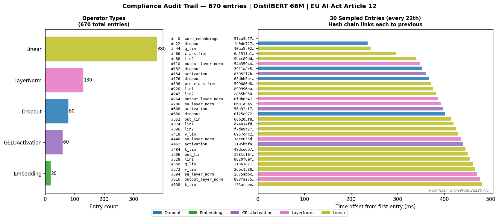 | 670-entry SHA-256 hash chain on DistilBERT (66M); tamper detection + JSONL WAL |
| 02 | [Fairness Gate](examples/02_fairness_gate/) | 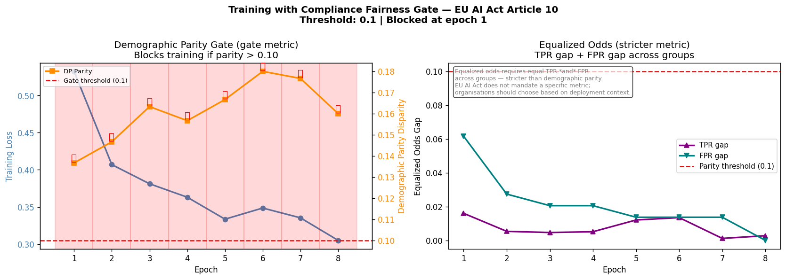 | Training blocked: parity 0.137 > threshold 0.10; all 8 epochs BLOCKED |
| 03 | [Captum Explainability](examples/03_captum_explain/) | 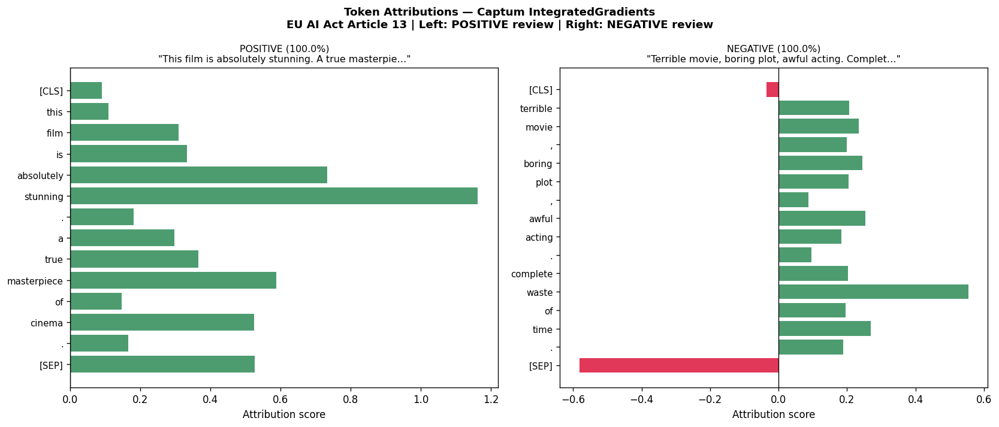 | Token attributions on 5 reviews; persisted to `attribution_log.jsonl` |
| 04 | [Opacus DP Training](examples/04_opacus_dp/) | 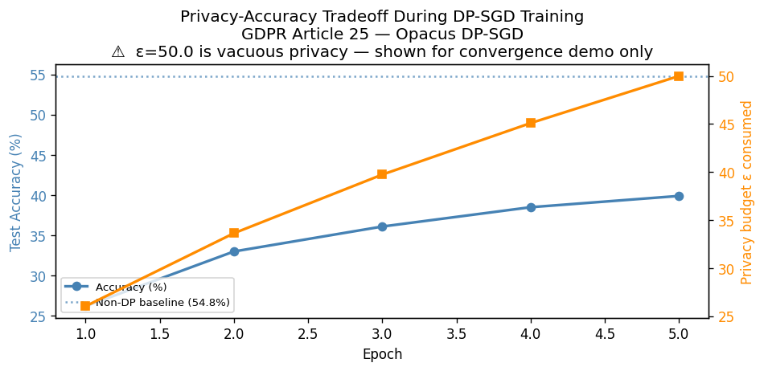 | CIFAR-10 DP-SGD ε=50; `EpsilonBudgetExceeded` fires at epoch 1 (ε=26 > max=8) |
| 05 | [Compliant Dataset](examples/05_compliant_dataset/) | 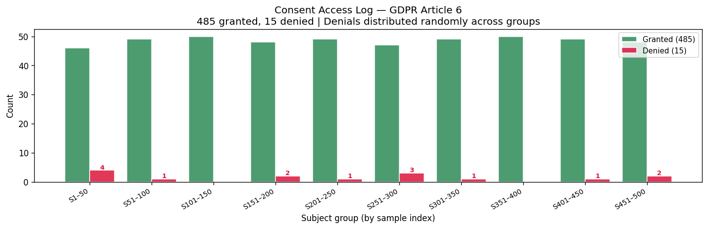 | 485 granted, 15 denied, 10:1 imbalance warning; purpose-scoped re-check |
| 06 | [Before vs After](examples/06_before_after/) | 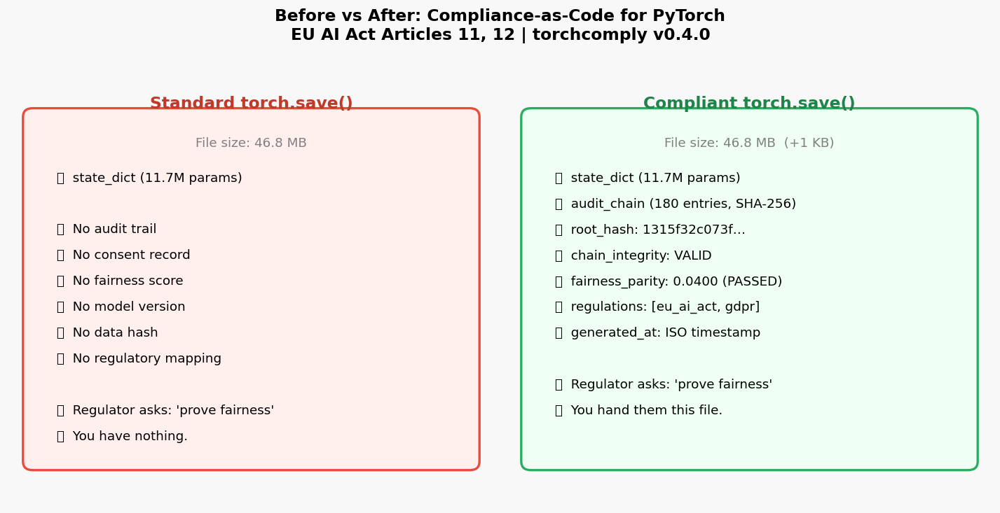 | Standard 46.8 MB vs compliant checkpoint with 180-entry chain, root hash, fairness |
| 07 | [CrypTen Secure Inference](examples/07_crypten_secure/) | 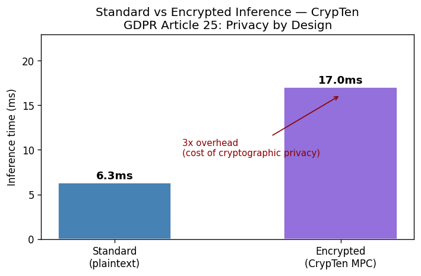 | MPC encrypted inference; error < 0.001; full layer coverage |
| 08 | [Three Mechanisms](examples/08_three_mechanisms/) | 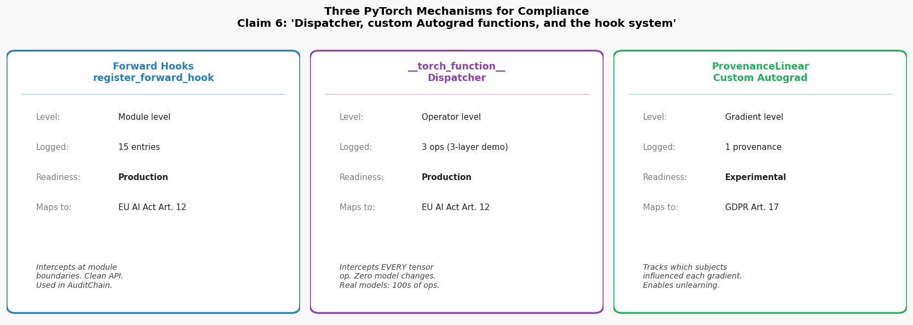 | Hooks + Dispatcher + Autograd — one script, three compliance surfaces |
| 09 | [Deployment Monitor](examples/09_deployment_monitor/) | 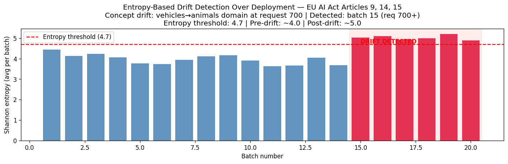 | Concept drift detected at batch 15 / request 700+; 620 human reviews |
| 10 | [Connected Pipeline](examples/10_connected_pipeline/) | 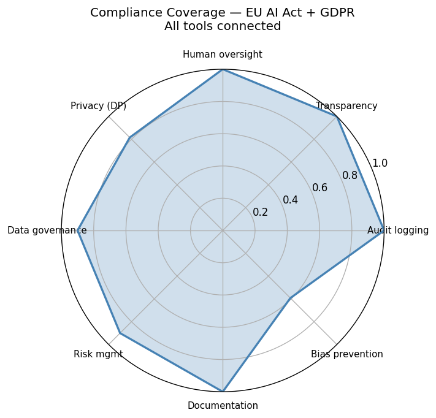 | All 10 stages ✅; context manager API; `ComplianceDiff` report; Annex IV PDF |
| 11 | [LLM Fine-Tuning](examples/11_llm_finetune/) | 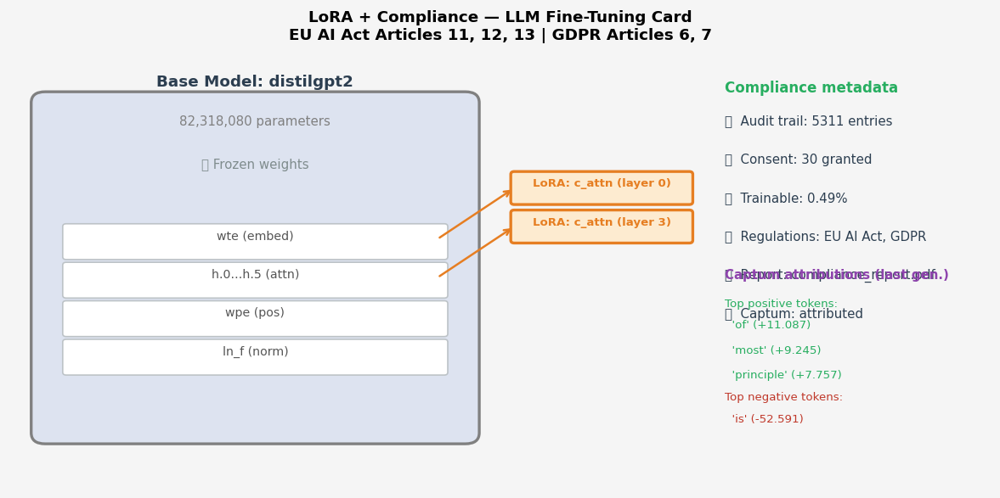 | DistilGPT-2 + LoRA (0.49% trainable); 5,311 audit entries; Captum attribution |

```bash
# Run all examples
for i in examples/[0-9]*/run.py; do python $i; done
```

---

## Components

| Component | What it does | Regulation |
|-----------|--------------|------------|
| `AuditChain` | SHA-256 hash-chained log of every forward pass; tamper-detection via `verify()` | Art.12 |
| `FairnessGate` | Blocks training when demographic parity disparity exceeds threshold | Art.10 |
| `CompliantDataset` | Consent-gated data loading with per-subject, per-purpose access control | GDPR Art.6, 7 |
| `ConsentRegistry` | Immutable consent ledger with access log | GDPR Art.6, 7 |
| `ComplianceTensor` | `torch.Tensor` subclass intercepting every operator via `__torch_function__` | Art.12 |
| `ProvenanceLinear` | Custom `autograd.Function` logging which subjects influenced each gradient | GDPR Art.17 |
| `CompliancePrivacyEngine` | Opacus DP-SGD with `max_epsilon` enforcement — raises `EpsilonBudgetExceeded` | GDPR Art.25, 32 |
| `EpsilonBudgetExceeded` | Raised by `check_epsilon()` when ε exceeds configured budget | GDPR Art.25 |
| `ComplianceExplainer` | Captum LayerIntegratedGradients with compliance logging | Art.13 |
| `ComplianceSecureInference` | CrypTen MPC encrypted inference with protocol log | GDPR Art.25 |
| `AnnexIVReport` | ReportLab PDF covering all EU AI Act Annex IV sections | Annex IV |
| `OtelComplianceLogger` | OpenTelemetry spans for real-time compliance observability | Art.14 |
| `ComplianceMLflowLogger` | MLflow metric logging for versioned compliance evidence | Art.9 |
| `ComplianceDiff` | Compares two `ComplianceSnapshot` instances; detects run-to-run regressions | Art.9 |
| `ComplianceSnapshot` | Point-in-time compliance state (audit hash, fairness, ε, drift) | Art.9 |
| `ComplianceEngine` | Unified entry point — context manager, model card, Annex IV PDF | All |

---

## Compliance Coverage

**34/37 EU AI Act high-risk requirements addressed (92%)** — full matrix: [`conformity_coverage.md`](conformity_coverage.md)

### EU AI Act

| Article | Obligation | Covered by |
|---------|-----------|------------|
| Art. 9  | Risk management | Pipeline + `ComplianceMLflowLogger` |
| Art. 10 | Data governance | `CompliantDataset`, `FairnessGate`, data_provenance extractor |
| Art. 11 | Technical documentation | `AnnexIVReport`, api_documentation extractor |
| Art. 12 | Record-keeping | `AuditChain`, `ComplianceTensor` |
| Art. 13 | Transparency | `ComplianceExplainer` |
| Art. 14 | Human oversight | `OtelComplianceLogger`, hookability extractor |
| Art. 15 | Accuracy, robustness | operator_determinism extractor |
| Art. 43 | Conformity assessment | `AnnexIVReport` |
| Art. 61 | Post-market monitoring | `inference_drift.py`, `deployment_monitor` |

### GDPR

| Article | Obligation | Covered by |
|---------|-----------|------------|
| Art. 6, 7 | Consent | `ConsentRegistry` |
| Art. 17 | Right to erasure | `ProvenanceLinear` |
| Art. 22 | Automated decisions | `ComplianceExplainer` |
| Art. 25 | Privacy by design | `CompliancePrivacyEngine`, `ComplianceSecureInference` |
| Art. 32 | Security | `CompliancePrivacyEngine` (DP-SGD) |

---

## Documentation

| File | Contents |
|------|----------|
| [`run_results.md`](run_results.md) | Latest example run results and test suite output |
| [`conformity_coverage.md`](conformity_coverage.md) | Full EU AI Act conformity matrix (37 requirements) |
| [`regulatory_mapping.md`](regulatory_mapping.md) | Component → regulation article mapping |
| [`static_analysis.md`](static_analysis.md) | Static analysis pipeline design and rationale |
| [`references.md`](references.md) | All references cited in source files and examples |
| [`SCREENSHOT_GUIDE.md`](SCREENSHOT_GUIDE.md) | Conference slide screenshot guide |

---

## Citation

```bibtex
@misc{pytorch_compliance_as_code_2026,
  title  = {PyTorch Compliance-as-Code: Static Analysis and Runtime Enforcement for EU AI Act / GDPR},
  author = {Hari Vijay, Raja Gopal},
  year   = {2026},
  note   = {PyTorch Conference Europe 2026, Station F, Paris},
}
```

## License

Apache-2.0 — see [LICENSE](LICENSE).
